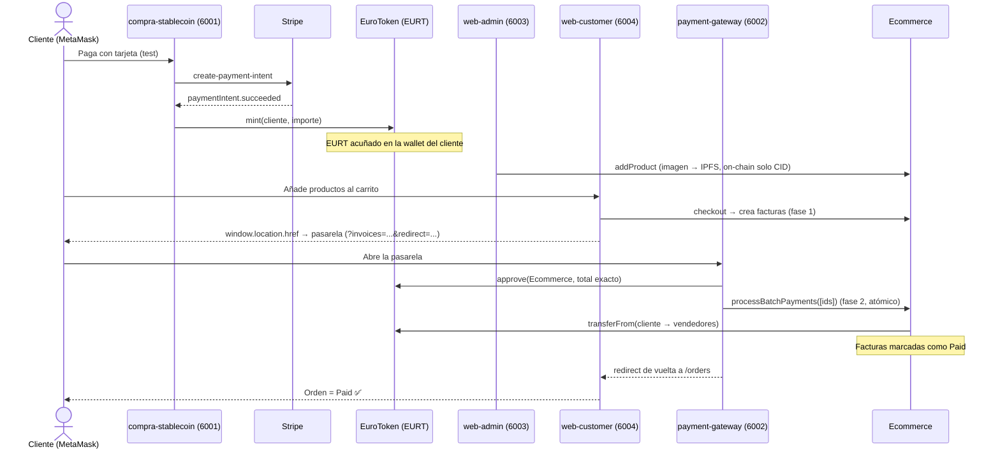

# 🛒 E-Commerce Web3 con Stablecoin EURT

<!-- 🇪🇸 NOTA: Este README es la entrega pública del Módulo 8. Está en español (documento de
     evaluación); el código y los identificadores del repo siguen en inglés. CLAUDE.md es la guía
     profunda para desarrolladores; este documento es el escaparate y la guía de prueba E2E. -->


Un **marketplace e-commerce Web3 multi-vendor** construido alrededor de una **stablecoin anclada al
euro (EURT)**. Un cliente compra EURT con una **tarjeta de crédito real (Stripe)**, y luego gasta ese
EURT **on-chain** para comprar productos a distintos comercios. El catálogo, los carritos, las
facturas y los pagos viven **en la blockchain** — las apps web son clientes ligeros sobre el estado
on-chain.

El pago final se liquida a través de una **pasarela de pago cripto** (`approve` + `processPayment`)
firmada con MetaMask, y un único checkout puede pagar a **varios vendedores de forma atómica**.

> Construido como **Módulo 8** del Máster CodeCrypto en *Blockchain & AI Systems Engineering*.
> Filosofía: **aprendizaje profundo sobre velocidad** — Stripe real, IPFS real (Pinata),
> 110 tests y 100% de cobertura del código de los contratos.

---

## 1. Flujo de extremo a extremo

1. **Comprar EURT** — el cliente paga con tarjeta en `compra-stablecoin` (Stripe). Tras confirmarse
   el pago, el backend mintea EURT a la wallet del cliente.
2. **Catálogo (admin)** — un comercio registrado publica productos en `web-admin`; las imágenes se
   suben a **IPFS (Pinata)** y on-chain solo se guarda el **CID**.
3. **Carrito y checkout** — el cliente añade productos en `web-customer` y hace checkout, que crea
   las **facturas on-chain** (fase 1) y redirige a la pasarela.
4. **Pago cripto** — en `payment-gateway` el cliente firma con MetaMask un `approve` por el importe
   exacto y un `processPayment` / `processBatchPayments` que liquida las facturas (fase 2).
5. **Verificación** — el cliente vuelve a `web-customer` y ve su orden marcada como **Paid**.



---

## 2. Arquitectura

```
ecommerce-web3/
├── apps/
│   ├── compra-stablecoin/   # 6001 · Comprar EURT con tarjeta (Stripe) → mint
│   ├── payment-gateway/     # 6002 · MetaMask: approve + processPayment
│   ├── web-admin/           # 6003 · Empresas, productos (IPFS), facturas, clientes
│   └── web-customer/        # 6004 · Catálogo, carrito, checkout, historial de órdenes
├── contracts/
│   ├── euro-token/          # Proyecto Foundry · EuroToken.sol (EURT)
│   └── ecommerce/           # Proyecto Foundry · Ecommerce.sol + 6 librerías
├── packages/                # Paquetes compartidos (planificados; ver nota abajo)
│   ├── shared-abis/         # ABIs de los contratos
│   ├── shared-types/        # Tipos TypeScript compartidos
│   └── shared-config/       # Direcciones de contratos y config de red
├── restart-all.sh           # Orquestación local (Anvil → deploy → seed → 4 apps)
├── scripts/                 # Scripts auxiliares (ver scripts/README.md)
├── docs/                    # ARCHITECTURE.md
├── CLAUDE.md                # Guía profunda para desarrolladores
├── pnpm-workspace.yaml  turbo.json  .nvmrc
└── README.md                # (este archivo)
```

> 🇪🇸 NOTA sobre `packages/`: son paquetes compartidos **planificados** como futura fuente única de
> verdad (ABIs/tipos/config). **Hoy no están implementados**: cada app lleva sus propios ABIs, tipos
> y config. Se documentan aquí para reflejar la estructura prevista del monorepo.

### Principios de diseño

- **Librerías `internal` + `using for`.** La lógica de `Ecommerce` se reparte en 6 librerías
  (`Company / Product / Customer / Cart / Invoice / Payment`) enganchadas con `using X for Y`. Esto
  mantiene el contrato principal pequeño (límite de 24 KB), mejora la legibilidad y el gas.
- **Multi-vendor atómico.** Un checkout genera una factura por vendedor; `processBatchPayments`
  las liquida **todas en una transacción** — o pasan todas, o revierte ninguna.
- **Checkout en 2 fases.** Fase 1: `checkout()` crea las facturas on-chain (estado pendiente).
  Fase 2: en la pasarela, `approve` + `processPayment(s)` mueve el EURT y marca las facturas como
  pagadas. Separar creación de pago permite redirigir entre apps de distinto origen sin perder estado.
- **Access control en 2 niveles.** `EuroToken` usa **Ownable** (solo el owner mintea). `Ecommerce`
  usa **AccessControl**: `DEFAULT_ADMIN_ROLE` (plataforma) puede registrar empresas, y un modifier
  `onlyCompanyOwner` restringe el CRUD de productos al dueño de cada empresa.

---

## 3. Stack tecnológico

| Capa            | Tecnologías |
|-----------------|-------------|
| **On-chain**    | Solidity `0.8.28` · Foundry (Forge/Anvil/Cast) · OpenZeppelin (ERC20, Ownable, AccessControl, ReentrancyGuard) |
| **Off-chain**   | Next.js 15 (App Router) · TypeScript (strict) · Tailwind CSS · ethers.js v6 |
| **Integraciones** | Stripe (Payment Intents, test mode) · IPFS vía Pinata · MetaMask (EIP-1193) |
| **Tooling**     | pnpm workspaces · Turborepo · Node 20 LTS |
| **Red local**   | Anvil (chainId `31337`, RPC `http://localhost:8545`) |

---

## 4. Requisitos previos

- **[Node 20 LTS](https://nodejs.org)** + **[pnpm](https://pnpm.io)** vía corepack (`corepack enable`).
- **[Foundry](https://book.getfoundry.sh/getting-started/installation)** (`foundryup`) — Forge, Anvil, Cast.
- **[MetaMask](https://metamask.io)** configurado para la red local Anvil (chainId `31337`, RPC `http://localhost:8545`).
- Una cuenta de **Stripe en modo test** (publishable + secret key) — para `compra-stablecoin`.
- Un **JWT de Pinata** (IPFS) — para subir imágenes de producto en `web-admin`.

---

## 5. Instalación

```bash
git clone <repo-url> ecommerce-web3
cd ecommerce-web3

corepack enable                 # habilita pnpm vía corepack
pnpm install                    # instala dependencias de todo el workspace

# Compila ambos proyectos Foundry
forge build --root contracts/euro-token
forge build --root contracts/ecommerce

# Copia y rellena las variables de entorno de cada app (ver §10)
cp apps/compra-stablecoin/.env.example apps/compra-stablecoin/.env
cp apps/payment-gateway/.env.example   apps/payment-gateway/.env
cp apps/web-admin/.env.example         apps/web-admin/.env
cp apps/web-customer/.env.example      apps/web-customer/.env
```

> 🇪🇸 NOTA: las direcciones de los contratos que van en los `.env` son **deterministas** en Anvil
> (mismas en cada arranque). Están listadas en §10 y las usa `restart-all.sh`.

---

## 6. Uso de `restart-all.sh`

Un único comando levanta todo el sistema local de cero:

```bash
./restart-all.sh
```

Es **idempotente** (seguro re-ejecutar): mata los procesos previos antes de arrancar. Los logs se
escriben en `/tmp/` (`/tmp/anvil.log`, `/tmp/app-6001.log`, …).

| Paso | Qué hace |
|------|----------|
| 1 | Mata procesos previos de Anvil y de las apps, y libera los puertos 8545 / 6001-6004. |
| 2 | Arranca **Anvil** (chainId `31337`) y espera a que el RPC responda. |
| 3 | Ejecuta `forge script DeployEcommerce.s.sol` → despliega **EuroToken + Ecommerce** en una pasada. |
| 4 | **Valida** que las direcciones desplegadas coinciden con las deterministas esperadas (ver §10). |
| 5 | Siembra datos: empresa **TechShop** (id 1, owner = acct1) + **3 productos** (Smartphone, Laptop, Bicicleta) + mintea **1000 EURT a acct1**. |
| 6 | Arranca las 4 apps con `pnpm --filter <app> dev` y espera HTTP 200 en cada puerto. |

> 🇪🇸 NOTA: el script **no** registra clientes ni wirea los `.env` automáticamente — los `.env` de
> las apps ya llevan preconfiguradas las direcciones deterministas. El registro de cliente ocurre en
> la app la primera vez que se interactúa (carrito/checkout).

---

## 7. Puertos

| Servicio           | URL                       | Puerto |
|--------------------|---------------------------|--------|
| Anvil (RPC)        | http://localhost:8545     | 8545   |
| compra-stablecoin  | http://localhost:6001     | 6001   |
| payment-gateway    | http://localhost:6002     | 6002   |
| web-admin          | http://localhost:6003     | 6003   |
| web-customer       | http://localhost:6004     | 6004   |

---

## 8. Cuentas de prueba (Anvil)

> ⚠️ **SOLO PARA DESARROLLO LOCAL.** Estas son las claves públicas y bien conocidas del mnemónico por
> defecto de Anvil (`test test test … junk`). **Nunca** las uses en una red real ni les envíes fondos
> con valor.

| Cuenta | Dirección | Clave privada | Rol |
|--------|-----------|---------------|-----|
| **acct0** | `0xf39Fd6e51aad88F6F4ce6aB8827279cffFb92266` | `0xac0974bec39a17e36ba4a6b4d238ff944bacb478cbed5efcae784d7bf4f2ff80` | Owner / deployer (owner de EuroToken, admin de la plataforma) |
| **acct1** | `0x70997970C51812dc3A010C7d01b50e0d17dc79C8` | `0x59c6995e998f97a5a0044966f0945389dc9e86dae88c7a8412f4603b6b78690d` | Owner de **TechShop** + dueño de los **1000 EURT** sembrados |
| **acct2** | `0x3C44CdDdB6a900fa2b585dd299e03d12FA4293BC` | `0x5de4111afa1a4b94908f83103eb1f1706367c2e68ca870fc3fb9a804cdab365a` | **Cliente** (sin fondos iniciales; se fondea con EURT vía el flujo Stripe) |

> 🇪🇸 NOTA importante para la demo: **acct1 es a la vez vendedor y tesorero** (tiene los 1000 EURT).
> Para una prueba E2E coherente conviene usar **acct2 como cliente** y fondearla con EURT en el paso 1
> — así no te "compras a ti mismo".

---

## 9. Variables de entorno por app

> 🇪🇸 NOTA: las `NEXT_PUBLIC_*` se exponen al navegador (no son secretas). El resto son **solo de
> servidor** (Stripe secret key, clave privada del minter, Pinata JWT) y nunca llevan prefijo público.
> Plantillas reales en cada `apps/<app>/.env.example`.

### compra-stablecoin (6001)
| Variable | ¿Secreta? | Propósito |
|----------|-----------|-----------|
| `NEXT_PUBLIC_STRIPE_PUBLISHABLE_KEY` | no | Clave cliente de Stripe |
| `NEXT_PUBLIC_EUROTOKEN_ADDRESS` | no | Dirección de EuroToken *(ver aviso de naming abajo)* |
| `NEXT_PUBLIC_RPC_URL` | no | RPC de Anvil |
| `NEXT_PUBLIC_CHAIN_ID` | no | `31337` |
| `NEXT_PUBLIC_PAYMENT_GATEWAY_URL` | no | URL de la pasarela (para el flujo demo legacy) |
| `STRIPE_SECRET_KEY` | **sí** | Clave servidor de Stripe (crear Payment Intent) |
| `WALLET_PRIVATE_KEY` | **sí** | Wallet owner que llama a `mint()` |
| `RPC_URL` | **sí** | RPC usado por las API routes del servidor |

### payment-gateway (6002)
| Variable | ¿Secreta? | Propósito |
|----------|-----------|-----------|
| `NEXT_PUBLIC_RPC_URL` | no | RPC de Anvil |
| `NEXT_PUBLIC_CHAIN_ID` | no | `31337` |
| `NEXT_PUBLIC_ECOMMERCE_ADDRESS` | no | Para `processPayment` / `processBatchPayments` |
| `NEXT_PUBLIC_EURO_TOKEN_ADDRESS` | no | Para `approve()` |

### web-admin (6003)
| Variable | ¿Secreta? | Propósito |
|----------|-----------|-----------|
| `NEXT_PUBLIC_RPC_URL` | no | RPC de Anvil |
| `NEXT_PUBLIC_CHAIN_ID` | no | `31337` |
| `NEXT_PUBLIC_ECOMMERCE_ADDRESS` | no | Contrato Ecommerce |
| `NEXT_PUBLIC_EURO_TOKEN_ADDRESS` | no | Contrato EuroToken |
| `NEXT_PUBLIC_IPFS_GATEWAY` | no | Gateway público para leer imágenes IPFS |
| `PINATA_JWT` | **sí** | Subida de imágenes a IPFS (Pinata) |

### web-customer (6004)
| Variable | ¿Secreta? | Propósito |
|----------|-----------|-----------|
| `NEXT_PUBLIC_RPC_URL` | no | RPC de Anvil |
| `NEXT_PUBLIC_CHAIN_ID` | no | `31337` |
| `NEXT_PUBLIC_ECOMMERCE_ADDRESS` | no | Contrato Ecommerce |
| `NEXT_PUBLIC_EURO_TOKEN_ADDRESS` | no | Contrato EuroToken |
| `NEXT_PUBLIC_IPFS_GATEWAY` | no | Leer imágenes de producto |
| `NEXT_PUBLIC_PAYMENT_GATEWAY_URL` | no | **Destino del redirect del checkout** a la pasarela |

> ⚠️ **Aviso de naming (inconsistencia real del repo):** `compra-stablecoin` nombra la dirección de
> EuroToken como **`NEXT_PUBLIC_EUROTOKEN_ADDRESS`** (sin guion bajo), mientras que las otras tres
> apps usan **`NEXT_PUBLIC_EURO_TOKEN_ADDRESS`**. Respétalo tal cual al rellenar cada `.env`.

### Direcciones deterministas (Anvil)
```
EuroToken (EURT)  = 0x5FbDB2315678afecb367f032d93F642f64180aa3
Ecommerce         = 0xe7f1725E7734CE288F8367e1Bb143E90bb3F0512
```

---

## 10. Guía de prueba completa (E2E)

> Prerrequisito: `./restart-all.sh` corriendo, y MetaMask conectado a Anvil (chainId `31337`).

1. **Comprar EURT (cliente = acct2).**
   - Importa **acct2** en MetaMask.
   - Abre `http://localhost:6001`, introduce un importe y paga con una tarjeta de test de Stripe
     (p.ej. `4242 4242 4242 4242`, fecha futura, CVC cualquiera).
   - Tras `paymentIntent.succeeded`, el backend mintea EURT a acct2. Verifica el saldo (en MetaMask
     o con `cast`).

2. **Catálogo (admin = acct1).**
   - Los 3 productos de **TechShop** ya están sembrados. Opcionalmente, abre `http://localhost:6003`
     con acct1 y añade un producto nuevo (sube una imagen → IPFS, se guarda solo el CID).

3. **Carrito y checkout (cliente = acct2).**
   - En `http://localhost:6004` añade uno o varios productos al carrito y pulsa **checkout**.
   - Se crean las facturas on-chain (fase 1) y la app redirige a la pasarela
     (`?invoices=...&redirect=.../orders`).

4. **Pago en la pasarela (cliente = acct2).**
   - En `http://localhost:6002` confirma: firma el `approve` (por el importe **exacto**) y luego el
     `processPayment` / `processBatchPayments`.
   - El EURT se transfiere del cliente al/los vendedor(es) y las facturas pasan a **Paid**.

5. **Verificar la orden.**
   - Vuelves automáticamente a `http://localhost:6004/orders`. La orden aparece como **Paid** con los
     nombres de producto resueltos. ✅

---

## 11. Smart contracts

### EuroToken (`contracts/euro-token`)
- ERC20 con **6 decimales** (como USDC: 1 EUR = 1 000 000 unidades base; los decimales son cosméticos,
  on-chain todo son enteros).
- **Ownable** (OpenZeppelin v5): solo el `owner` puede `mint(address,uint256)`. Emite evento `Mint`.

### Ecommerce (`contracts/ecommerce`)
- Orquestador con **AccessControl** y **ReentrancyGuard**, compuesto por 6 librerías vía `using for`:
  `CompanyLib · ProductLib · CustomerLib · CartLib · InvoiceLib · PaymentLib`.
- Funciones de pago: `processPayment(uint256)` (una factura) y `processBatchPayments(uint256[])`
  (varias, atómico; revierte con array vacío). Guard `ProductCompanyMismatch(companyId, productId)`
  que evita pagar al vendedor equivocado si el `companyId` denormalizado del carrito no coincide con
  el real del producto.

### Comandos Foundry
```bash
# EuroToken
forge build   --root contracts/euro-token
forge test    --root contracts/euro-token -vvv
forge coverage --root contracts/euro-token

# Ecommerce
forge build   --root contracts/ecommerce
forge test    --root contracts/ecommerce -vvv
forge coverage --root contracts/ecommerce

# Desplegar localmente (ambos contratos en una pasada)
forge script script/DeployEcommerce.s.sol \
  --root contracts/ecommerce \
  --rpc-url http://localhost:8545 --broadcast \
  --private-key 0xac0974bec39a17e36ba4a6b4d238ff944bacb478cbed5efcae784d7bf4f2ff80
```

---

## 12. Testing

**110 tests en total, todos pasando = 8 (euro-token) + 102 (ecommerce).**

| Proyecto | Tests | Cobertura del código fuente (medida con `forge coverage`) |
|----------|-------|------------------------------------------------------------|
| euro-token | 8 | `EuroToken.sol`: **100%** (líneas 5/5, statements 3/3, ramas, funcs 2/2) |
| ecommerce | 102 | `Ecommerce.sol`: **100%** (112/112 líneas, 127/127 statements, 13/13 ramas, 28/28 funcs) · las **6 librerías: 100%** en todo |

> 🇪🇸 NOTA: la cobertura del **código de los contratos** (EuroToken + Ecommerce + 6 librerías) es del
> **100%** en líneas, statements, ramas y funciones. Los `Total` agregados que imprime `forge coverage`
> bajan solo porque incluyen los **scripts de despliegue** (`script/*.s.sol`), que no se testean por
> convención.

**Patrones de test:** `vm.prank` y `vm.startPrank` / `vm.stopPrank` para cambiar de actor,
`vm.expectRevert` para asertar errores, `vm.expectEmit` para eventos, *fuzz testing* en EuroToken, y
un test **E2E** en ecommerce que invoca el propio `DeployEcommerce` script como harness de despliegue.

---

## 13. Decisiones técnicas clave

| Decisión | Razón |
|----------|-------|
| `approve` por **importe exacto** (no `MaxUint256`) | Mínima superficie de riesgo: la pasarela solo aprueba lo que se va a pagar, en vez de un allowance infinito. |
| Helper **`parseEurt`** (`src/lib/format.ts`) | Convierte un string en euros a `bigint` con 6 decimales de forma centralizada y consistente. |
| **Diff** sobre `getCustomerInvoices` | El checkout calcula los IDs de factura **nuevos** comparando la lista antes/después, sin depender de devolver IDs desde la transacción. |
| **`window.location.href`** para el redirect | El checkout salta de `web-customer` (:6004) a `payment-gateway` (:6002): distinto origen ⇒ navegación de página completa, no `router.push`. |
| Guard **`ProductCompanyMismatch`** | Valida que el `companyId` denormalizado del carrito coincide con el real del producto, evitando pagar al vendedor incorrecto. |
| **CID** almacenado como `string` (≥46 chars) | On-chain solo se guarda el identificador de IPFS, no los bytes de la imagen (almacenar bytes on-chain sería prohibitivo). |
| El backend **mintea solo tras `paymentIntent.succeeded`** | Nunca se confía en el navegador para confirmar el pago: el EURT se acuña únicamente cuando Stripe confirma el cobro de la tarjeta. |

---

## 🤖 Desarrollo asistido por IA

Este proyecto se construyó usando **Claude Code** (Anthropic) como compañero de desarrollo.
Ver [`CLAUDE.md`](./CLAUDE.md) — la guía maestra leída tanto por la IA como por humanos.

Filosofía de colaboración: la IA acelera el boilerplate y la explicación; el humano es dueño de la
arquitectura y las decisiones. Cada decisión técnica de este repo fue entendida por el autor antes de
ser commiteada.

---

## 📄 Licencia

[MIT](LICENSE) © 2026 alebeta06
